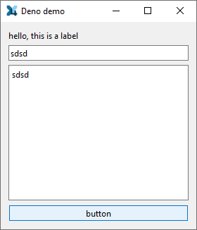

# x4qt
QT bindings for deno

This is a work in progress to implement something like pyside but in typescript.

The fun part in the process is that there is a .idl (interface definition language) parser to generate `.cpp` & `.h` code plus `.ts` code. So no headache to make corrections.


This way, you can write something like that:

```ts
import * as qt from "./qt.ts"

//debugger;
const app = new qt.QApplication( "" );

const frame = new qt.QWidget( );
frame.setWindowTitle( "Deno demo" );
frame.setWindowIcon( "assets/mylogo.png" );

const label = new qt.QLabel( "hello, this is a label" );
const edit = new qt.QLineEdit( );
const medit = new qt.QTextEdit( );
const button = new qt.QPushButton( "button" );

const layout = new qt.QVBoxLayout( );
layout.addWidget( label )
layout.addWidget( edit )
layout.addWidget( medit )
layout.addWidget( button )

frame.setLayout( layout );
frame.show( );

app.exec( );

```

